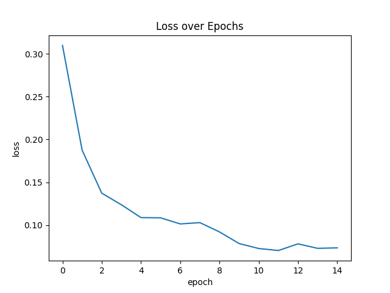
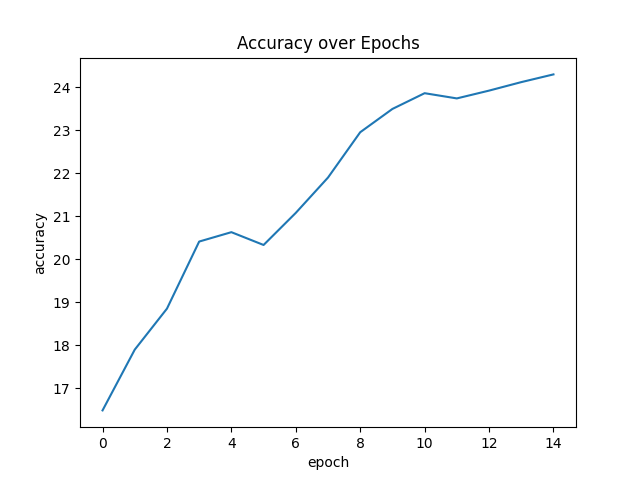
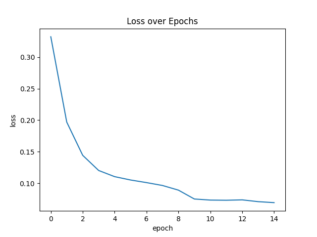
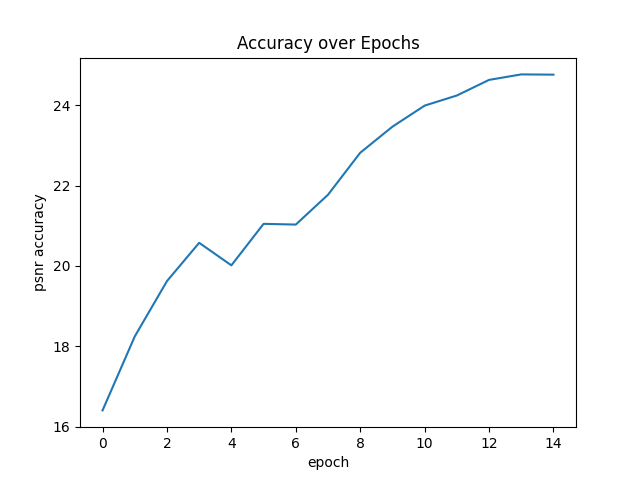
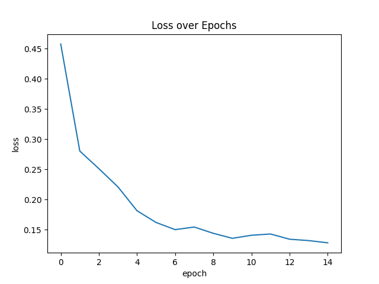
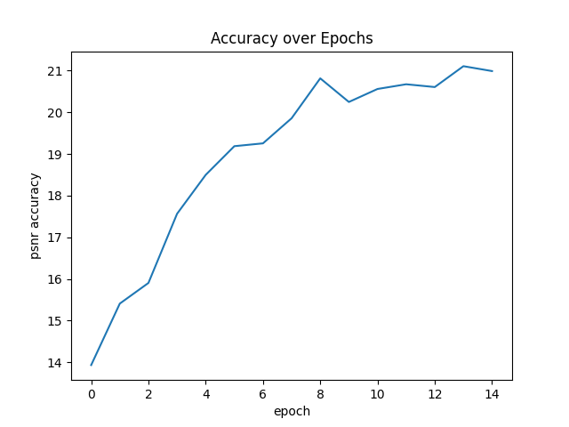
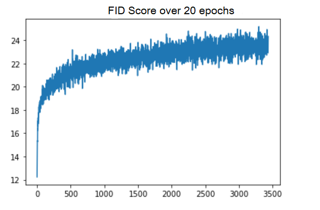

# Implicit Functions Coding Group 2

## Local Implicit Image Function (LIIF)

### Code
The authors of the LIIF paper posted their [LIIF implementation](https://github.com/yinboc/liif) here, and this code was used to conduct the experiments. The implicit.ipynb notebook was used in Google Collab to run the model on the three datasets loaded into the repo.

### Experiments: Training on 3 Datasets

The following datasets were trained on
* DIV2K - a large dataset used for pretraining the LIIF model used in the paper.  Contains original high resolution images and low resolution versions of those same images at varying zoom levels.
* B100 - a smaller dataset used for benchmarking the accuracy of continuous imaging models
* Urban100 - another smaller dataset for benchmarking the accuracy of continuous imaging models

B100 and Urban100 were mainly used because of the heavy memory and compute resources required to train on larger datasets like DIV2K and CelebAHQ.  These datasets are different than the other models in our group because LIIF does not attempt to model 3-D spaces, thus datasets like Deep Voxels would not work with this model.

The EDSR-baseline model was trained on Colab using a batch size of 16, an adam optimizer with a learning rate of 0.0001, and 15 epochs.  The training data was also augmented. 

### Results: Training on 3 Datasets
#### DIV2K
As you can see the loss curve flattened around 10 epochs and the psnr accuracy rose to about 25.  Since we did not have the compute to run at 1000 epochs like the paper, we couldn't reach the psnr values of around 33 that were met in their experiments, however the loss curve converged much quicker than expected.

  
   

### B100
Due to the B100 dataset being smaller in both size and resolution, our model is able to achieve slightly higher psnr values than DIV2K.  This may be due to having to learn less features and the validation set being more similar and less general than the abundance of DIV2K images.

  
   

### Urban100
In the Urban100 dataset our loss curve flattened the earliest around 6 epochs.  We believe this caused the lower psnr accuracy results as the train data was overfitted.

  
   

## Conclusion: Training from scratch
Both the DIV2K and B100 datasets led to good psnr scores of around 24, while Urban100 overfitted and dropped in accuracy.  If we were to train over more epochs, the DIV2K dataset would likely have achieved a higher psnr score due to the size of the data.

## Experiments: Testing Pre-Trained Models on CelebAHQ
Now we tested which LIIF model would evaluate the best on the large CelebAHQ dataset.  Each of the prior three datasets were used for pre-training.  You can see in the results below that the model trained on DIV2K outperformed the smaller datasets.  This matches with the higher LIIF performance in the paper when the model was trained on DIV2K.  Since B100 and Urban100 are commonly used for benchmarking rather than pre-training, it would make senes they would yield a low PSNR score.

## Results: Accuracy on CelebAHQ
| Pretrained Dataset | DIV2K | B100 | Urban100 |
| -- | -- | -- | -- |
| PSNR Accuracy | 16.83 | 8.78 | 9.02

## NeRF

The original authors' [NeRF implementation](https://github.com/bmild/nerf) was done in TensorFlow. NeRF is built using an MLP that maps from location and direction to color and opacity (of pixels). The difficulty in implementing NeRF is in the data preprocessing to clean the images with the spatial and directional data necessary for the model to correctly learn. Once the spatial representation is learned, any camera location within the sparse dataset can be simulated or added together to create small clips. 

The test below compares a PyTorch implementation based off of this [github](https://github.com/kwea123/nerf_pl) with the original author's implementation of applying NeRF to images of a fern. 

The original paper achieved a PSNR of 25.17 while ours was generally closer to about 27. The main difference in training was that our implementation had a slower learning rate decay. 

Training took close to 8 hours on Colab. 

## Nerf in the wild

NeRF-w expands on the original paper and allows for NeRF to be more adaptable to photos that weren't necessarily taken with this intended use in mind. NeRF-w takes two additional inputs that are embedding vectors, which allows the model to separate the static and transient aspects of the training. There is not yet an official implementation of NeRF-w, but the github used for the previous NeRF tests had an unofficial version of NeRF-w. This model is smaller than the one defined in the paper, but is able to provide comparable results as seen below. 

The original paper had a PSNR of 29.08. The PSNR of this implementation maxes out at about 4. However, the images were downsized to make the runtime reasonable, which explains why the number is somewhat lower. The original authors additionally had higher computing power and the ability to train for significantly longer.

The training for the Brandenburg representation took an entire day. The experiment can be repeated in the same colab notebook as NeRF by checking out the nerfw branch and uploading the (recommended to be already locally downsized) brandenburg dataset from the paper's author's website to the colab disk space. 

### Conclusion
Both NeRF and Nerf-w provide impressive results under the right scenarios, but require significant compute time to achieve these results. The results are also significantly limited by the quality of the training dataset. 

## GIRAFFE Summary

### Description - GIRAFFE- Representing Scenes as Compositional Generative Neural Feature Fields

GIRAFFE is a learning-based rendering engine used to represent scenes as compositional generative Neural Features Fields. It is used for image synthesis. 
The main idea of implementing giraffe is that it incorporates a compositional 3D scene into the generative model to get more controlled image synthesis. 
Using this model the features of objects present in input image are extracted and added. Using this model one can achieve different scenes like rotating 
object, changing background, changing depth, changing horizontally. The Data set used in this is a local dataset with 1000s of images of cars. These input 
images are parsed through the generative model to create new images with unique and novel features. A compositional 3D scene is applied to generative model
to get the set of rotating images, change in depth and horizontal representation.

### Result

## Conclusion
GIRAFFE provides good results of image synthesis.

